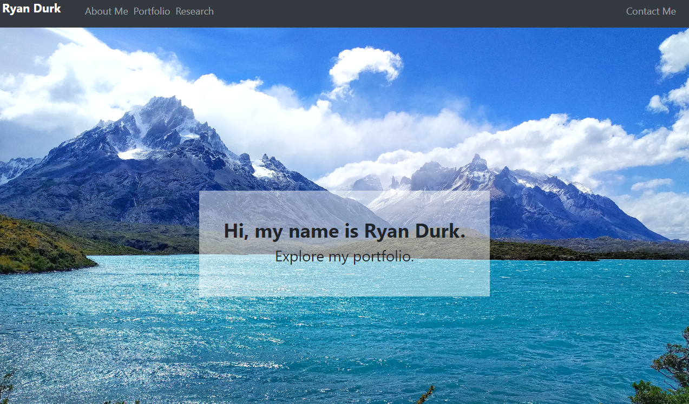

# Ryan Durk's Portfolio

This portfolio contains information about me.  Including, my background, research, and places I can be contacted. 

URL of the deployed application: https://rpdurk.github.io/RyanDurkPortfolio/

URL of the GitHub repository: https://github.com/rpdurk/RyanDurkPortfolio

## Table of Contents 

* [Description](#description)
* [View](#view)
* [Highlights](#highlights)
* [License](#license)

## Description

>Come learn about me through this website hosting my portfolio.  Learn about my interests, professional work, research, and current projects.  If you want to continue the conversation, reach out!

This web page is being ran with a variety of programing languages including, HTML, CSS, and javascript.  The design uses Bootstrap's responsive front end framework. 

## View

To learn more about me or see the website, you can click [here](https://rpdurk.github.io/RyanDurkPortfolio/).

## Highlights

In my portfolio I talk about:

* Professional Career
* Research
* Projects

  

## License 

MIT License Copyright (c) 2020  Ryan Durk
